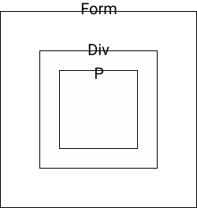
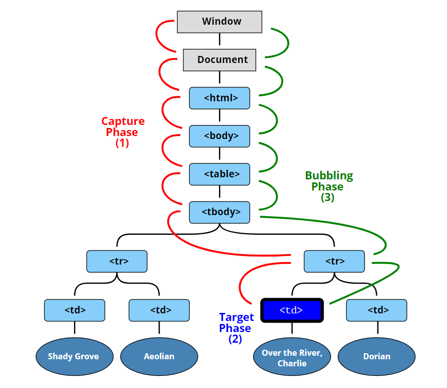

# 이벤트 캡처링과 버블링

### 버블링

이벤트 버블링이 무엇인지 설명하는 것보다 코드로 이해하는 것이 더 쉬울 것 입니다.<br>

아래 코드를 봅시다.<br>

```
<form onclick="alert('form')">FORM
  <div onclick="alert('div')">DIV
    <p onclick="alert('p')">P</p>
  </div>
</form>
```



3개의 요소가 중첩된 형태이며 각각은 핸들러가 할당되어 있습니다.<br>

여기서 만약 p태그를 클릭하게 된다면 어떠한 일이 발생할까요?<br>

1. p 태그에 할당된 onclick 핸들러가 작동합니다.

2. 바깥의 div 태그에 할당된 onclick 핸들러가 작동합니다.

3. 그 바깥의 form 태그에 할당된 onclick 핸들러가 작동합니다.

4. document 객체를 만날 때까지, 각 요소에 할당된 onclick 핸들러가 작동합니다.

`이처럼 한 요소에 이벤트 발생하면 이 요소에 할당된 핸들러가 동작하고 이어서 부모 요소의 핸들러가 차례대로 동작하는 것`<br>

`가장 최상단의 조상 요소를 만날 때까지 이 과정이 반복되면서 요소 각각에 할당된 핸들러가 동작하는 것을 바로` **이벤트 버블링** `이라고 합니다.`<br>

이벤트가 제일 깊이 안쪽에 있는 요소부터 시작해 부모 요소를 거슬러 올라오며 실행되는 모습이 마치 `버블` 같다고 여겨져 붙여진 이름인가 봅니다.<br>

참고로 이벤트는 정확히 어디서 발생했는지 자세한 정보를 알려주는 객체가 2개 존재합니다.<br>

- event target

- this(event.currentTarget)

event target과 this는 한 가지 차이점이 존재합니다.<br>

event target은 실제 이벤트가 시작된 `타겟`입니다. 반면, this는 현재 실행중인 핸들러가 할당된 요소를 참조합니다.<br>

[버블링 코드](#버블링)에서 하나하나 비교해 보겠습니다.<br>

1. p태그를 클릭 시 -> event.target(p) / event.currentTarget(form)

1. div태그를 클릭 시 -> event.target(div) / event.currentTarget(form)

1. form태그를 클릭 시 -> event.target(form) / event.currentTarget(form)

### 캡처링

이벤트 흐름 단계에는 버블링 외에도 총 3가지가 존재합니다.<br>

1. 캡처링 단계(이벤트가 하위 요소로 전파되는 단계)

2. 타겟 단계(이벤트가 실제 타겟 요소에 전달되는 단계)

3. 버블링 단계(이벤트가 상위 요소로 전파되는 단계)



위 그림을 인용하면 td태그를 클릭 시 발생하는 일은 이벤트가 최상위 객체에서 아래로 전파되고(캡처링 단계), 이벤트가 타겟 요소에 도착해 실행된 후(타겟 단계), 다시 위로 전파됩니다.(버블링 단계)<br>

하지만 우리가 실제로 사용하는 이벤트는 버블링을 많이 이용하며 현재 캡처링을 사용하고 있지는 않습니다.<br>

참고로 addEventListener메서드에서 이벤트 캡처링을 사용하는 방법은 세번째 인자로 capture 옵션을 true로 설정하는 것 입니다.(default값은 false이며 버블링을 사용할 것을 암시)<br>

`addEventListener('click', () => 핸들러, {capture:true}); or true`<br>

캡처링 이벤트를 삭제하는 것도 마찬가지로 capture 상태를 명시해줘야 합니다.<br><br>

지금까지 우리가 알아본 것을 요약하면 다음과 같습니다.<br>

이벤트는 최상위 객체부터 시작해 DOM 트리를 따라 event.target까지 내려간다. 이후 타겟 요소에 설정된 핸들러가 호출된다. 마지막으로 이벤트가 event.target부터 시작해 다시 최상위 노드 객체까지 전달된다.<br>

실제로 이벤트를 사용할 때는 캡처링을 명시하지 않기 때문에 암시적으로 버블링을 사용하게 되는데 이는 타겟 요소의 이벤트가 먼저 호출되게 하기 위함이다.<br>

버블링과 캡처링은 `이벤트 위임`의 토대가 되며 이것은 이벤트 핸들링의 강력한 패턴이며 추후에 다뤄보겠습니다.<br>

참고 -> [모던 자바스크립트 이벤트 캡처링과 버블링](https://ko.javascript.info/bubbling-and-capturing)<br>

[다음 글로 이동하기 -> 이벤트 위임](./Delegation.md)
