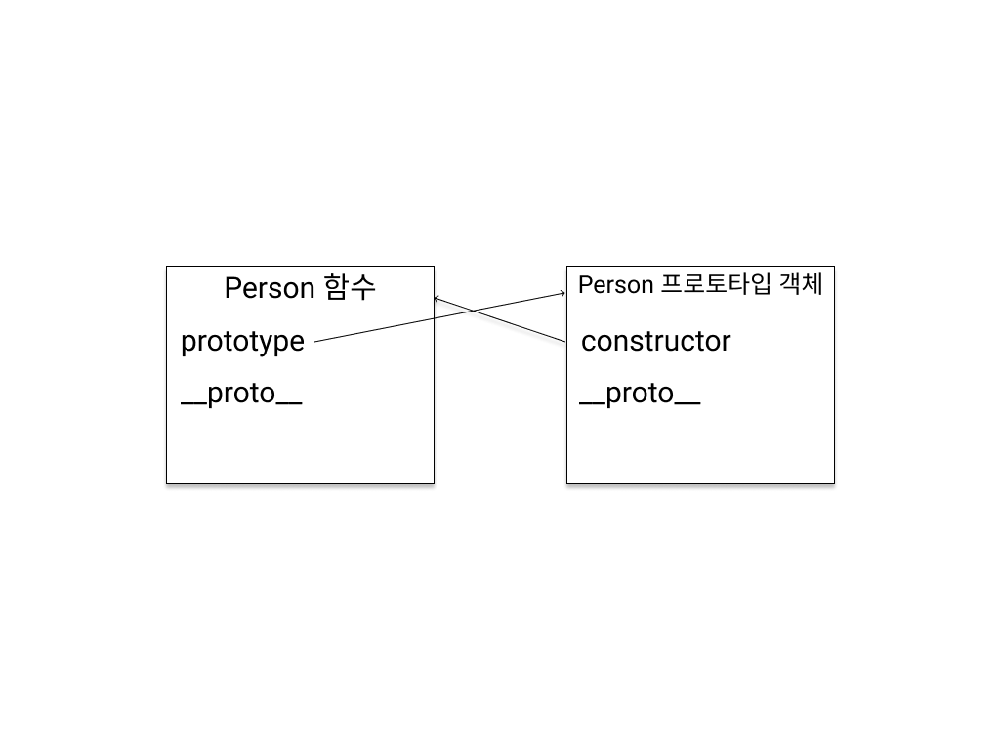
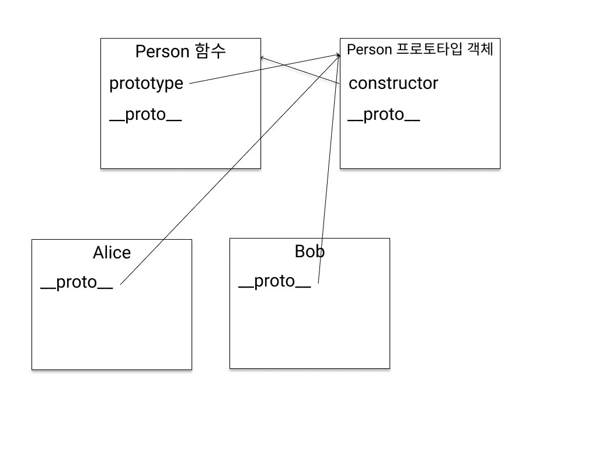

# Prototype

[이전 글로 이동하기 -> Execution Context(실행 컨텍스트)](../Context/Context.md)

### 도입부

프로토타입이 무엇인가 알아보기 전에 자바스크립트라는 언어에 대해 조금 살펴볼 필요가 있습니다.<br>

우리가 사용하는 프로그래밍 언어 중 C++, Java 등등, 대부분의 언어들은 `class`라는 개념을 사용하며 객체지향 프로그래밍을 지향하고 있습니다.<br>

클래스를 사용해 객체를 만들고 객체를 토대로 프로그래밍을 해나가는 것이죠.<br>

하지만 자바스크립트는 이와 다르게 클래스라는 개념이 없다는 것입니다.(최근에 ES6에 추가되었다)<br>

그래서 기존의 객체를 복사하여 새로운 객체를 생성하는 프로토타입이라는 개념을 사용합니다.<br>

즉, 자바스크립트는 프로토타입 기반 객체지향 프로그래밍이라 불리며 프로토타입을 사용하여 객체를 생성하고 확장해 나갑니다.<br>

그만큼 자바스크립트에서 프로토타입은 중요한 역할을 한다고 볼 수 있기 때문에 반드시 개념을 이해하고 넘어가야 합니다.<br>

### prototype과 [[Prototype]]

프로토타입은 프로토타입 객체와 프로토타입 링크가 무엇인지 알 수 있어야 합니다.<br>

먼저 정의부터 내려봅시다.<br>

- **prototype** | **프로토타입 객체**

  자바스크립트에서 함수를 정의하면 파싱단계에서 내부적으로 수행되는 작업이 있는데, 그 중 하나는 함수 멤버에 prototype속성을 추가하게 됩니다.

  prototype 속성은 어딘가에 생성된 프로토타입 객체를 참조하게 됩니다.

- **[[Prototype]]** | **프로토타입 링크**

  [[Prototype]]은 자신의 원형이 되는 객체, 즉 프로토타입 객체를 참조 자바스크립트에서 모든 객체라면 가지고 있는 속성 입니다.(함수도 객체이므로 가지고 있다)

  [[Prototype]]은 보이지 않는 속성으로 ****proto**** 라는 속성으로 참조할 수는 있지만 비표준 속성이며 모든 브라우저에서 지원하는 것이 아니기 때문에 실제로 사용하지 않는 것을 추천드립니다.

개념 정의로는 이해하기 어려울 수 있으니 다음 코드를 통해 설명해 보겠습니다.<br>

```
function Person() {}
```



함수가 선언되면 위 그림과 같이 Person 함수는 prototype속성을 가지게 되며 prototype은 어딘가 생성된 Person 프로토타입 객체를 참조하게 됩니다.<br>

또한 Person 프로토타입 객체는 `constructor` 속성을 가지며 우리가 맨 처음 선언했던 Person함수를 참조하게 됩니다.<br>

`즉, 우리가 함수를 선언하면 보이지는 않지만 어딘가에 프로토타입 객체를 만들어 서로 연결시키는 구조를 가지게 되는 것 입니다.`<br>

그리고 가장 중요한 것은 `Person함수의 prototype 속성이 가리키는 Person 프로토타입 객체는 우리가 new 생성자와 Person함수를 통해 생성된 모든 객체의 원형이 되는 객체`라는 것입니다.<br>

이해가 어려울 수 있으니 아래 그림과 코드를 통해 예를 들어보겠습니다.<br>

```
function Person() {}

var Alice = new Person();
var Bob = new Person();
```



위와 같이 함수가 정의된 상태에서 Person함수와 new 생성자를 통해 새로운 객체 Alice와 Bob을 생성했습니다.<br>

Alice와 Bob은 각각 객체이므로 proto(프로토타입 링크)라는 속성을 가지는데 이는 프로로타입 객체를 가리키게 됩니다.<br>

여기서 Alice와 Bob의 proto(프로토타입 링크)는 누구를 가리킬까요?

이것은 Alice와 Bob이 객체로 생성될 때 어떤 함수에 의해 생성되었는지 생각해봐야 합니다.<br>

그리고 그 함수의 prototype과 연결되어 있는 객체를 Alice와 Bob객체의 프로토타입 객체라고 하는 것 입니다.<br>

따라서 Alice와 Bob 객체의 proto는 자신의 프로토타입 객체인 Person 프로토타입 객체를 가리키게 됩니다.<br>

`즉, proto(프로토타입 링크)는 함수와 new 생성자를 통해 객체가 생성되었을 때 그 함수의 prototype 속성이 가리키는 프로토타입 객체를 참조하는 역할을 맡고 있습니다.`<br>

요약 ->

1. 함수가 정의되면 함수의 prototype 속성과 프로토타입 객체의 constuctor 속성에 의해 서로 연결되어 있다.

2. 함수와 new 생성자를 통해 객체를 생성하면 객체가 가지는 proto속성이 함수의 prototype 속성이 참조하는 원형이 되는 객체인 프로토타입 객체를 참조하게 됩니다.<br>
   (`Alice.__proto__ === Person.prototype | Bob.__proto__ === Person.prototype`)
